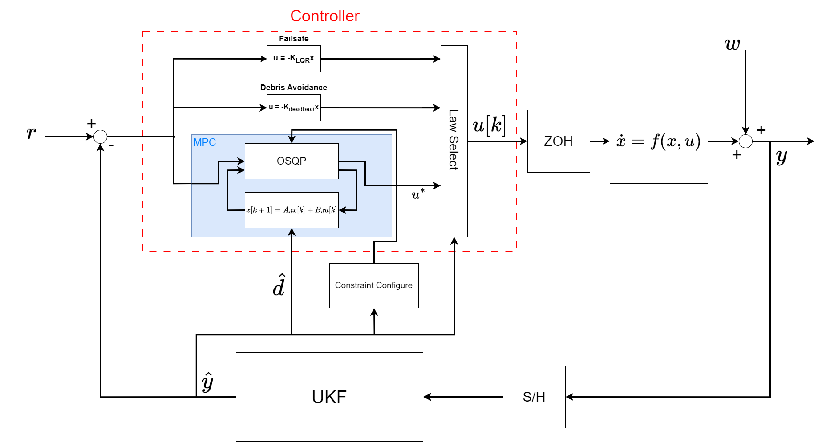

# Overview
Codebase for the project described in these [slides](MPC_ARPO_Slides.pptx). 

Implements a custom offset-free Model Predictive Control (MPC) algortihm for the autonomous guidance of a 0-dimensional chaser spacecraft
performing terminal RPO manuevers, under coplanar and circular orbit assumptions.

**User-defined functionality for the following is included:**
- Discrete and continuous-time simulation
- Linear and nonlinear plant models
- Continuous acceleration and impulsive delta-v input models
- MPC with and without integral action (disturbance rejection)
- Basic 3D animations of trajectories in Vpython
- Automated simulation runs and cataloging

Minimal documentation is provided within the source code itself.

The MPC algorithm implements the Operator-Splitting Quadratic Program (QP) solver, [OSQP](https://github.com/osqp/osqp). 

It utilizes [Vpython](https://github.com/vpython) for rough 3D animations of generated trajectories. 

For literature sources, please see the  "References" section at the end of the slides.
# `src/` Directory
This directory contains the necessary code for the algorithm and simulation.

For a general idea of code function, pictured below is a block diagram describing the operation of [`src/simulateTrajectoryC.py`](src/simulateTrajectoryC.py)- currently the most complex simulation in the repo:

## [`src/mpcsim.py`](src/mcsim.py)
This module defines various objects used for handling the many simulation and controller parameters associated with the
algorithm.

It also contains a function for plotting general simulation results.

## [`src/simulateTrajectory.py`](src/simulateTrajectory.py)
This function is used to perfrom ***discrete-time simulations*** of the MPC algorithm on a ***linear plant*** (Clohessy-Wiltshire eqns.).

### [`src/simhelpers.py`](src/simhelpers.py)
This module contains helper functions used by the simulation for organization/readability.

## [`src/simulateTrajectoryC.py`](src/simulateTrajectoryC.py)
This function is used to perfrom ***continuous-time*** simulations of the MPC algorithm on a ***nonlinear plant***.

## [`src/animateTrajectory.py`](src/animateTrajectoryC.py)
This function is used to generate basic low-fidelity animations of a given trajectory in Vpython.

# `test/` Directory
This directory contains very roughly constructed scripts used offline to generate and reduce the data shown in [`MPC_ARPO_Slides.pptx`](MPC_ARPO_Slides.pptx).

**These can be optimized signifcantly, and should only be used as rough guides for source code use.**

## [`test/traj_eval_radial.py`](test/traj_eval_radial.py)
This script was used to construct simulations with varying parameters utilizing `#src/simulateTrajectory.py`.

## [`test/traj_eval_radialC.py`](test/traj_eval_radialC.py)
This script was used to construct simulations with varying parameters utilizing `#src/simulateTrajectoryC.py`.

## [`test/traj_eval_in_track.py`](test/traj_eval_in_track.py)
This script was was used similarly to `test/traj_eval_radial.py`, only for simulation runs in the in-track direction. 

## [`test/dist_rej_comp.py`](src/simulateTrajectoryC.py)
Script that was used to compare the performance of an MPC controller using offset-free methodologies vs a "normal" MPC
controller, as noise becomes more constant in time.

## [`test/animations_results.py`](src/simulateTrajectoryC.py)
Script used to create Vpython animations from stored simulation runs that were generated automatically over time.

# `misc/` Directory
**These files are relics from before the codebase was organized and version control was implemented.**

I have included them here purely as an insight into the stream-of-consciousness developing that the final project evolved from. They are rough and completely unorganized,
and serve only as potentially interesting snapshots of my thought process. 
